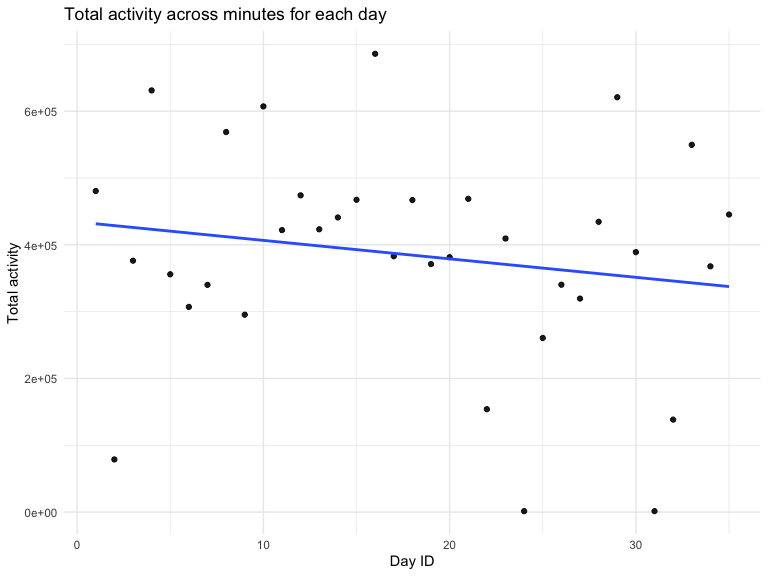

p8105_hw3_ys3508
================

# Problem 1

## load package

``` r
library(p8105.datasets)
```

## Read in the data

``` r
data("instacart")

instacart = 
  instacart %>% 
  as_tibble(instacart)
```

## Answer Questions

### Problem 1.1

Aisles_id

``` r
instacart %>%
  group_by(aisle) %>%
  summarise(n_aisles = n()) %>%
  arrange(desc(n_aisles))
## # A tibble: 134 × 2
##    aisle                         n_aisles
##    <chr>                            <int>
##  1 fresh vegetables                150609
##  2 fresh fruits                    150473
##  3 packaged vegetables fruits       78493
##  4 yogurt                           55240
##  5 packaged cheese                  41699
##  6 water seltzer sparkling water    36617
##  7 milk                             32644
##  8 chips pretzels                   31269
##  9 soy lactosefree                  26240
## 10 bread                            23635
## # … with 124 more rows
```

134 aisles are there, and fresh vegetables and fresh fruits are the most
items ordered from.

### Problem 1.2

Make a plot that shows the number of items ordered in each aisle,
limiting this to aisles with more than 10000 items ordered. Arrange
aisles sensibly, and organize your plot so others can read it.

``` r
bar_aisle <- instacart %>% 
  count(aisle) %>%
  filter(n > 10000) %>% # limiting this to aisles with more than 10000 items ordered
  mutate(aisle = fct_reorder(aisle, n)) %>% 
  ggplot(aes(x = aisle, y = n)) +
    geom_bar(stat='identity') +
    xlab("Aisle")+
    ylab("The number of items ordered")+
  ggtitle("The number of items ordered in each aisle (aisle > 10000)") +
  theme(axis.text.x = element_text(angle = 60, hjust = 1))
bar_aisle
```


### Problem 1.3

Make a table showing the three most popular items in each of the aisles
“baking ingredients”, “dog food care”, and “packaged vegetables fruits”.
Include the number of times each item is ordered in your table.

``` r
instacart %>% 
  filter(aisle == "baking ingredients" | aisle ==  "dog food care" | aisle ==  "packaged vegetables fruits") %>% 
  group_by(aisle) %>% 
  count(product_name) %>% 
  mutate(product_ranking = min_rank(desc(n))) %>% # rank from the most popular to less polular
  filter(product_ranking < 4) %>%  # list top 3 in each aisle
  arrange(desc(n)) %>%  # order the table by n
  knitr::kable() # making the table
```

| aisle                      | product_name                                  |    n | product_ranking |
|:---------------------------|:----------------------------------------------|-----:|----------------:|
| packaged vegetables fruits | Organic Baby Spinach                          | 9784 |               1 |
| packaged vegetables fruits | Organic Raspberries                           | 5546 |               2 |
| packaged vegetables fruits | Organic Blueberries                           | 4966 |               3 |
| baking ingredients         | Light Brown Sugar                             |  499 |               1 |
| baking ingredients         | Pure Baking Soda                              |  387 |               2 |
| baking ingredients         | Cane Sugar                                    |  336 |               3 |
| dog food care              | Snack Sticks Chicken & Rice Recipe Dog Treats |   30 |               1 |
| dog food care              | Organix Chicken & Brown Rice Recipe           |   28 |               2 |
| dog food care              | Small Dog Biscuits                            |   26 |               3 |

### Problem 1.4

Make a table showing the mean hour of the day at which Pink Lady Apples
and Coffee Ice Cream are ordered on each day of the week; format this
table for human readers (i.e. produce a 2 x 7 table).

``` r
instacart %>% 
  filter(product_name == "Pink Lady Apples" | product_name == "Coffee Ice Cream") %>% 
  group_by(product_name, order_dow) %>%
  summarize(mean_hour = mean(order_hour_of_day)) %>%
  spread(key = order_dow, value = mean_hour) %>%
  knitr::kable(digits = 2)
```

| product_name     |     0 |     1 |     2 |     3 |     4 |     5 |     6 |
|:-----------------|------:|------:|------:|------:|------:|------:|------:|
| Coffee Ice Cream | 13.77 | 14.32 | 15.38 | 15.32 | 15.22 | 12.26 | 13.83 |
| Pink Lady Apples | 13.44 | 11.36 | 11.70 | 14.25 | 11.55 | 12.78 | 11.94 |

# Problem 2

## load data

``` r
accel = 
  read_csv(
    "data/accel_data.csv") %>% 
  janitor::clean_names() %>% 
  pivot_longer(
    activity_1:activity_1440,
    names_to = "minute", 
    names_prefix = "activity_",
    values_to = "activity_counts") %>% 
  mutate(
    minute = as.numeric(minute),
    activity_counts = as.numeric(activity_counts),
    week = as.factor(week),
    day = factor(day, levels = c("Sunday", "Monday", "Tuesday", "Wednesday", "Thursday", "Friday", "Saturday")),
    weekday_vs_weekend = ifelse(day == "Saturday" | day == "Sunday" , "weekend", "weekday")) %>%
  arrange(day)
```

## Answer Questions

### Probelm 1.1

The resulting dataset have 6 variables, including “week”, “day_id”,
“day”, “weekday_vs_weekend”, “minute” and “activity_counts”, with 50400
observations in total.

### Problem 1.2

Traditional analyses of accelerometer data focus on the total activity
over the day. Using your tidied dataset, aggregate across minutes to
create a total activity variable for each day, and create a table
showing these totals. Are any trends apparent?

``` r

accel %>% 
  group_by(day_id) %>% 
  summarize(
    total_activity = sum (activity_counts)) %>% 
  knitr::kable(digits = 3)
```

| day_id | total_activity |
|-------:|---------------:|
|      1 |      480542.62 |
|      2 |       78828.07 |
|      3 |      376254.00 |
|      4 |      631105.00 |
|      5 |      355923.64 |
|      6 |      307094.24 |
|      7 |      340115.01 |
|      8 |      568839.00 |
|      9 |      295431.00 |
|     10 |      607175.00 |
|     11 |      422018.00 |
|     12 |      474048.00 |
|     13 |      423245.00 |
|     14 |      440962.00 |
|     15 |      467420.00 |
|     16 |      685910.00 |
|     17 |      382928.00 |
|     18 |      467052.00 |
|     19 |      371230.00 |
|     20 |      381507.00 |
|     21 |      468869.00 |
|     22 |      154049.00 |
|     23 |      409450.00 |
|     24 |        1440.00 |
|     25 |      260617.00 |
|     26 |      340291.00 |
|     27 |      319568.00 |
|     28 |      434460.00 |
|     29 |      620860.00 |
|     30 |      389080.00 |
|     31 |        1440.00 |
|     32 |      138421.00 |
|     33 |      549658.00 |
|     34 |      367824.00 |
|     35 |      445366.00 |

``` r


activity_per_day <- accel %>% 
    group_by(day_id) %>%
  summarize(
    total_activity = sum (activity_counts)) %>% 
  ggplot(aes(x = day_id, y = total_activity)) +
  geom_point(alpha = .9) + 
  coord_cartesian() +
  geom_smooth(method=lm, se=FALSE) +
  ggtitle("Total activity across minutes for each day") +
  ylab("Total activity") +
  xlab("Day ID")
activity_per_day
```



### Problem 1.3

Accelerometer data allows the inspection activity over the course of the
day. Make a single-panel plot that shows the 24-hour activity time
courses for each day and use color to indicate day of the week. Describe
in words any patterns or conclusions you can make based on this graph.

# Problem 3

## load data

``` r
data("ny_noaa")
```
